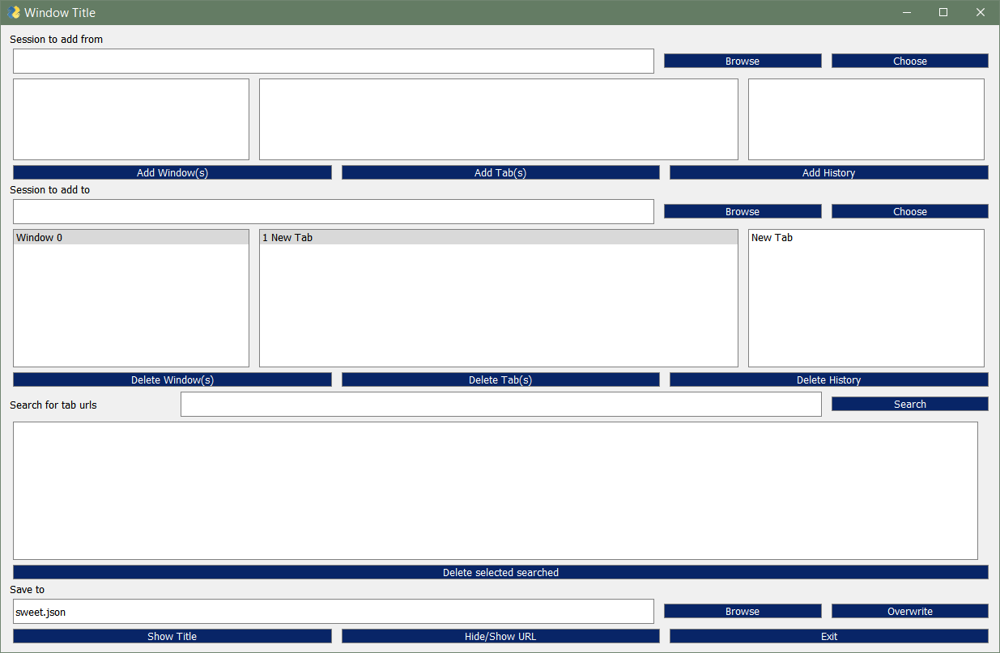

# sessionjsonmodifier
View and modify session jsons

In progress, currently allows for 
* searching of tabs to delete
* deleting windows 
* deleting tabs
* adding windows from one session to another

Can switch from title to URL. Avoid doing this as it's a bit buggy. Click on selected window/tab/history or search button again before modifying for best results. 

Works best when started while firefox is running and there is a current recovery.jsonlz4. Save changes somewhere, force quit firefox from task manager/activity monitor/etc., switch out the recovery.jsonlz4, restart, load the session. Causes firefox switch to tab to be buggy.

Unlikely to be expanded upon, it already hits all of my needs. Might find out how a quit from Firefox menu might work instead of a force quit.

Uses lz4, PySimpleGUIQt with PySide2, and appdirs for finding the folder where all the mozilla profile information is kept.
